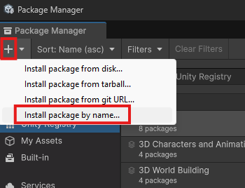

# MirrorVR Debugging Guide

Here's a simple guide for grabbing your game logs on both Quest and PC. Providing us with your logs where you have an issue is a key step to fixing your issue and helping us improve MirrorVR.

## First Steps

The first thing you will want to do to properly set this up is go to the Network Manager object.\
Once there, go to Mirror VR Manager, and scroll down to the Settings section.

Find Logger Level, and set that to Info.

<figure><figcaption></figcaption></figure>

Now, find the EOS Manager component.\
Change Transport Logger Level to Info, and EOS Logger Level to Very Verbose.

<figure><figcaption></figcaption></figure>

And just like that, you're all set to begin!

## Meta Quest



First of all, make sure you have a PC and a cord to connect your Quest to your PC (usually USB-A to USB-C).\
Any A to C (or C to C cable, if your PC supports it) cable will do, as long as it has data transferring capabilities.

You'll also need Developer Mode enabled on your headset. If you don't have Dev Mode on, you can do so [here](https://youtube.com/watch?v=kRpZGBhWxis). 



Go into any Unity Project, doesn't matter what it is. The best choice would be your game's project, but that's up to you. 



Now, we need to install the Android Logcat package to get logs.\
Open the Package Manager with the following menus:

If on 6000.0 and below:\
`Window > Package Manager`

If on 6000.1 and above:\
`Window > Package Management > Package Manager`



Now, go to the top left-hand corner. There should be a `+` (plus) icon. Click on it, and choose `Install package by name...`.

<figure><figcaption></figcaption></figure>

Type in `com.unity.mobile.android-logcat`, and hit `Install`.

<figure><figcaption></figcaption></figure>



Once it installs, go to `Window > Analysis > Android Logcat`.

Connect your headset, and it should now show a green "<mark style="color:green;">Connected</mark>" text at the bottom left.

<figure><figcaption></figcaption></figure>



Now, we have to set filters in order to see things properly. \
Click on the "Priority" box, and set Priority to info.

<figure><figcaption></figcaption></figure>

Now, click on the "Tag" box, and select "Unity" and "CRASH".

<figure><figcaption></figcaption></figure>

If you do not see those tags, hit "Tag Control..." and add them EXACTLY how they are shown.



Great! Now we are all set up. At the bottom left now, it should say: \
"<mark style="color:green;">Connected</mark> : Filtering with Priority 'Info', Tags 'Unity, CRASH'"

Launch your Unity game in VR now as you normally would, and logs will appear.



Now that you have the logs, you need to send them to us. Once your play session is done, select the Android Logcat window, and simply press `Ctrl (Cmd) + A` and `Ctrl (Cmd) + C`.

Create a new file, and name it in this format:\
`YYYY-MM-DD <Game Name> Mirror VR Logs.log`&#x20;

Then, just simply paste in the contents with `Ctrl (Cmd) + V`, and hit `Ctrl (Cmd) + S` to save.



Once your log file is ready, either attach it to your GitHub issue or send it to thetechwiz5305 or shad0w\_dev on Discord.



And you're done! Great job.



## Windows

Logs are easy to get on Windows. Super easy.\
The only thing you need in advance is&#x20;



Press Win + R. The run window should pop up, and it should look like this.

<figure><figcaption></figcaption></figure>



Paste into it the following (make sure to replace the company name and game name with their values):\
`%LOCALAPPDATA%Low/<Company Name>/<Game Name>/`

Here's an example I did for Lethal Company:\
`%LOCALAPPDATA%Low/ZeekerssRBLX/Lethal Company/`

What this does is open Unity's persistent data storage folder, mainly used for game data.



Now, in this folder, we need one file: `Player.log`. That's it.

<figure><figcaption></figcaption></figure>

Rename it to the following:\
`YYYY-MM-DD <Game Name> Mirror VR Logs.log`&#x20;

And you're all set!



Once your log file is ready, either attach it to your GitHub issue or send it to thetechwiz5305 or shad0w\_dev on Discord.



And you're done! Great job.



## Unity Editor



Unity Editor is straightforward. Enter play mode and collect your logs if you haven't already.\
**Make sure you have Info, Warning, and Error enabled in the console.**



Once you have collected your logs, go to the console tab.\
If your console tab is not open, go to `Window >  General > Console`.



Now, simply press `Ctrl (Cmd) + A`, and `Ctrl (Cmd) + C`.\
All the logs should now be highlighted and in your clipboard.



Create a new file, and name it in this format:\
`YYYY-MM-DD <Game Name> Mirror VR Logs.log`&#x20;

Then, just simply paste in the contents with `Ctrl (Cmd) + V`, and hit `Ctrl (Cmd) + S` to save.



Once your log file is ready, either attach it to your GitHub issue or send it to thetechwiz5305 or shad0w\_dev on Discord.

And you're done! Great job.


